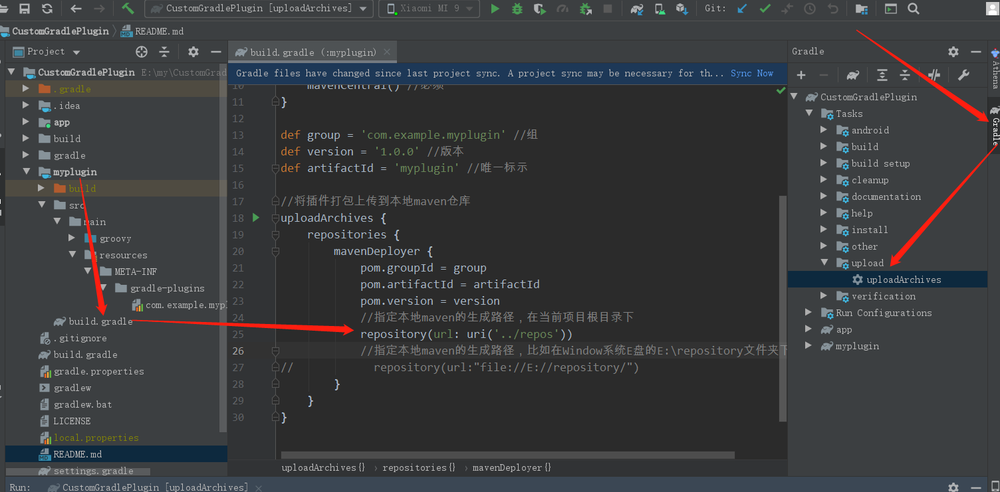

# CustomGradlePlugin
自定义Gradle插件、Gradle相关task

github地址:https://github.com/DJ-LEE11/CustomGradlePlugin

## 自定义Gradle本地插件

### 相关参看文档
自定义Gradle插件方式-https://www.jianshu.com/p/f902b51e242b

Gradle插件本地路径设置-https://www.jianshu.com/p/cff4684803f3

### 本地自定义Gradle插件生成

  

1、在对应插件目录的build.gradle文件下，指定插件的生成目录。
2、生成Gradle插件
方式一：
点击Gradle -> Tasks -> upload -> uploadArchives

方式二：
window终端执行命令行gradlew uploadArchives
mac终端执行命令行gradlew uploadArchives