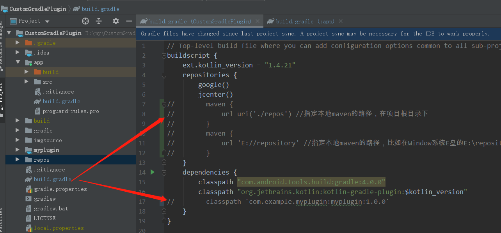
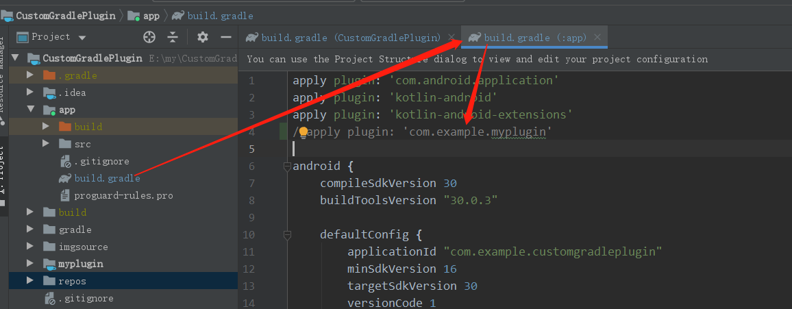
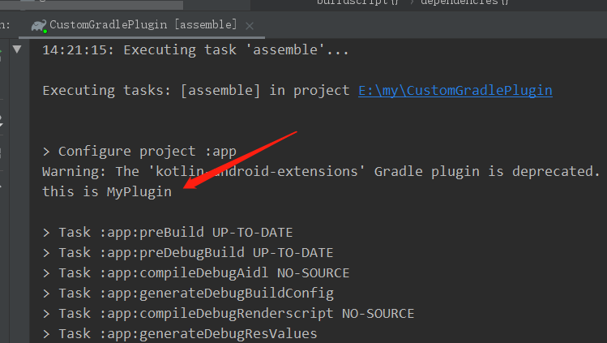

# CustomGradlePlugin
自定义Gradle插件、Gradle相关task

github地址:https://github.com/DJ-LEE11/CustomGradlePlugin

## 自定义Gradle本地插件

### 相关参看文档
自定义Gradle插件方式-https://www.jianshu.com/p/f902b51e242b

Gradle插件本地路径设置-https://www.jianshu.com/p/cff4684803f3

### 本地自定义Gradle插件生成

  

1、在对应插件目录的build.gradle文件下，指定插件的生成目录地址。

2、生成Gradle插件
- 方式一：
- 点击Gradle -> Tasks -> upload -> uploadArchives
- 方式二：
- window终端执行命令行gradlew uploadArchives
- mac终端执行命令行gradlew uploadArchives

### 本地Gradle插件使用

1、首先需要通过上述步骤生成一个本地插件。

2、在根目录的build.gradle文件中，将maven仓库地址注释恢复，将地址改成本地插件目录地址，最后将classPath注释移除。

  

3、在需要用到的project中的build.gradle文件，添加apply plugin，比如在app模块下添加。

  

4、运行项目可以看到本地插件的日志。

  

