### 一、开播流程

#### 游戏开播

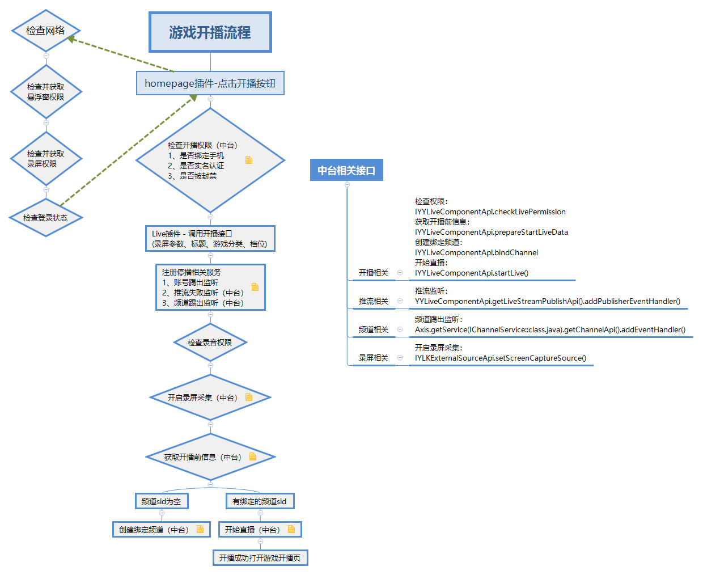

#### 娱乐开播

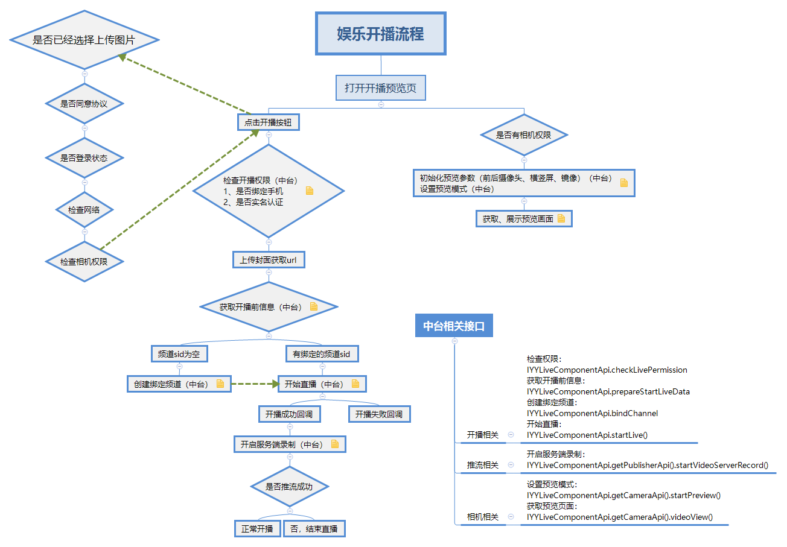

#### 开播架构调整

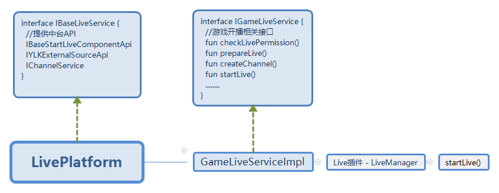

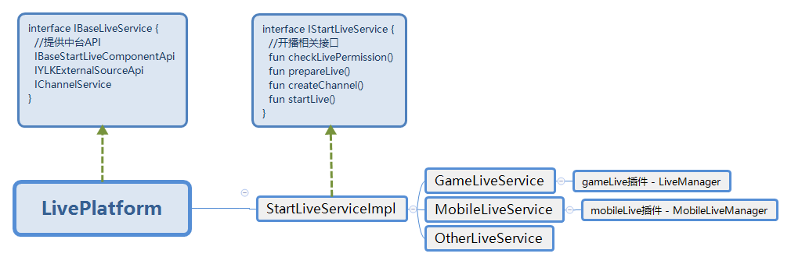

### 二、注意事项

#### 开发注意事项

1、弹dialog使用launchWhenResumed，弹出时机不对可能会导致生命状态异常。

   [崩溃case](http://bug.yy.com/browse/ANASSI-588)
   
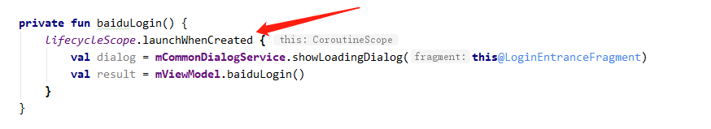

2、弹dialog注意下层级，本页面的弹窗就不要弹到parent上面，使用childFragmentManager。
   [崩溃case](http://bug.yy.com/browse/ANASSI-824)

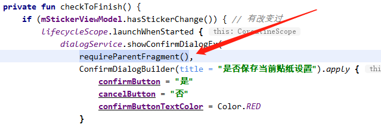

3、异步的findView需要进行判空处理。
   [崩溃case](http://bug.yy.com/browse/ANASSI-837)
   
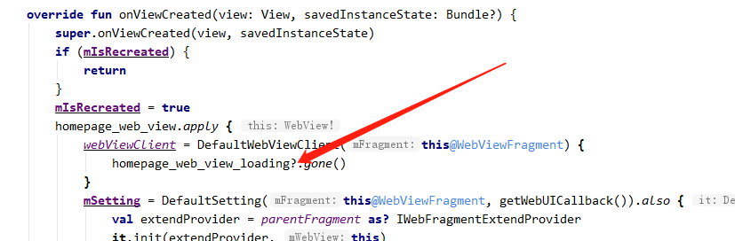

4、服务器协议字段没有@NonNull需要进行判空处理。
   [崩溃case](http://bug.yy.com/browse/ANASSI-801)
   
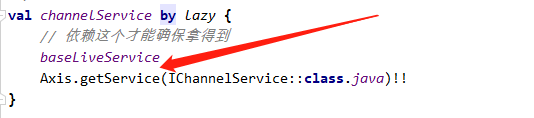

5、Smartrefreshlayout控件的混淆问题。
   [崩溃case](http://bug.yy.com/browse/ANASSI-776)

修改前：
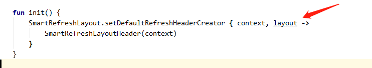

修改后：
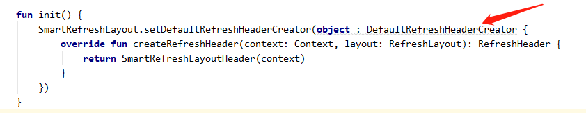

6、view重新加载问题。

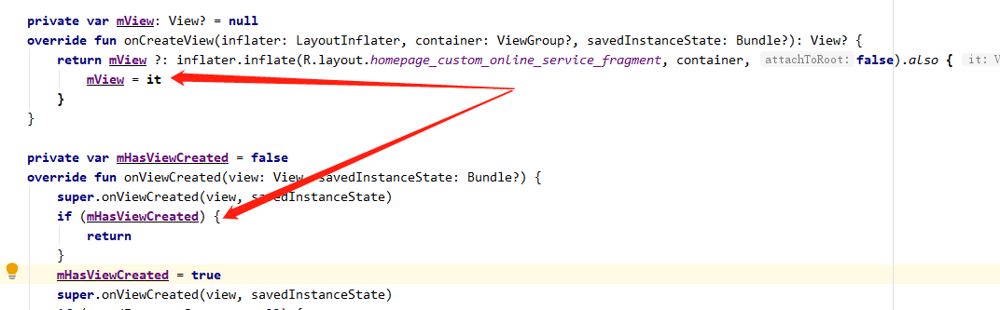

### 其他注意事项

1、主要的代码逻辑文件（例如Repo、ViewModel、Fragment）上面要加新需求代码，
   或者SDK相关文件中，可以加上相关链接，方便以查找对应的文档。
   格式：Update: 日期 版本 [需求名](文档链接地址)
   
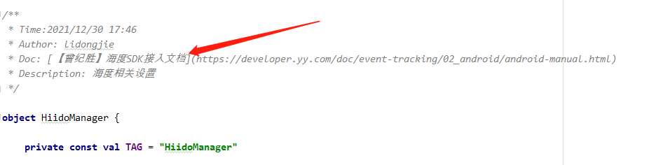

2、codestyle 不要合并import

3、资源文件、控件命名加上插件前缀

4、不是很耗时很频繁的日志就不要用debug
  有数据信息的就打info 不然怎么定位问题

5、navigationService  permissionService记得不要存下来 一定要用get=
  这两个是依赖activity的
  CommonService定义的可以直接用，不用自己重新定义个成员变量get=
  这样就不用考虑用哪种方式了

6、bug修复统一提交格式：
bug原因 ：写清楚为什么会出现这个问题
修复方案：做了什么修改解决的
影响范围：修改影响到哪些功能，需要验证
验证版本：宿主（必写）和修改的插件的版本号（例如：apk#916，homepage#42，没改的插件不用写）

###  三、其他优化

1、下拉刷新使用ping

2、海度初始化可以用abtest设置一下批量上报，性能更好一点