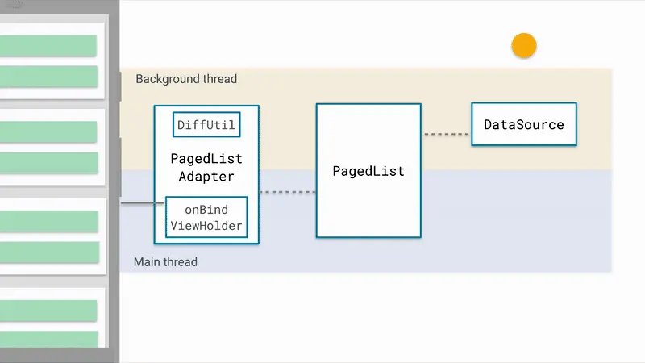
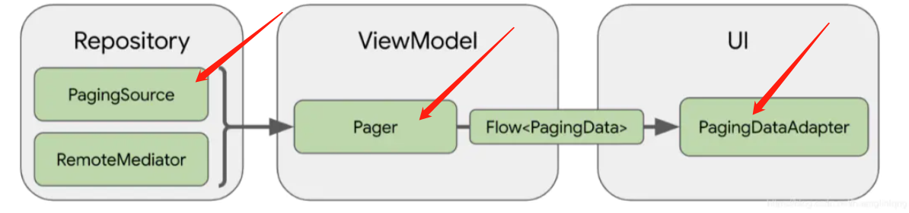

### 一、开播流程

#### 游戏开播

#### 娱乐开播

#### 开播架构调整

### 二、开发注意事项

1、弹dialog使用launchWhenResumed，弹出时机不对可能会导致生命状态异常。

   [崩溃case](http://bug.yy.com/browse/ANASSI-588)
   

2、弹dialog注意下层级，本页面的弹窗就不要弹到parent上面，使用childFragmentManager。
   
   [崩溃case](http://bug.yy.com/browse/ANASSI-824)

3、异步的findView需要进行判空处理。
   
   [崩溃case](http://bug.yy.com/browse/ANASSI-837)
   

4、服务器协议字段没有@NonNull需要进行判空处理。
   
   [崩溃case](http://bug.yy.com/browse/ANASSI-801)
   

5、Smartrefreshlayout控件的混淆问题。
   
   [崩溃case](http://bug.yy.com/browse/ANASSI-776)

修改前：

修改后：

6、view重新加载问题。

###  三、其他优化

1、使用Paging分页库实现分页逻辑。

2、海度初始化可以用abtest设置一下批量上报，性能更好一点