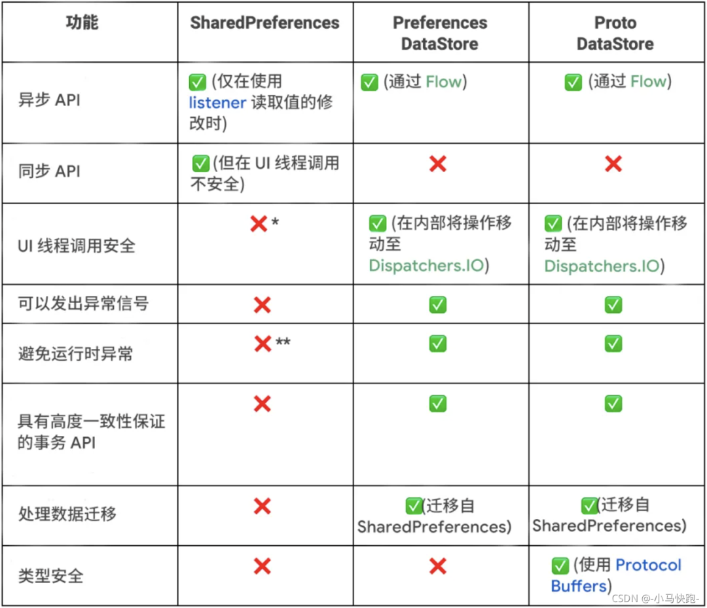

# Android前后台切换监听方案

### 一、旧方案

在Application中registerActivityLifecycleCallbacks，通过变量统计然后判断出是前台还是后台。

    application.registerActivityLifecycleCallbacks(object :
            Application.ActivityLifecycleCallbacks {

            、、、、、、、、

            override fun onActivityStarted(activity: Activity) {
                resumedActCount++
                KLog.i(TAG, "应用回到前台")
            }

            override fun onActivityStopped(activity: Activity) {
                resumedActCount--
                if (resumedActCount == 0) {
                    KLog.i(TAG, "应用退到后台")
                }
            }
        })

### 二、新方案 ProcessLifecycleOwner

ProcessLifecycleOwner是Google Lifecycle中的一个类，更优雅的监听前后台的切换。

1、添加依赖

     // 使用前需引用一下：
    implementation "android.arch.lifecycle:extensions:1.1.1"
	implementation 'android.arch.lifecycle:runtime:1.1.1'

2、在Application中使用

    class MyApp : Application(), LifecycleEventObserver {

    	override fun onCreate() {
        	super.onCreate()
        	ProcessLifecycleOwner.get().lifecycle.addObserver(this)
    	}

    	override fun onStateChanged(source: LifecycleOwner, event: Lifecycle.Event) {
        	when (event) {
            	Lifecycle.Event.ON_START -> {
                	KLog.i(TAG, "应用回到前台")
            	}
            	Lifecycle.Event.ON_STOP -> {
                	KLog.i(TAG, "应用回到后台")
            	}
        	}
    	}
    }

# Jetpack-DataStore

### 一、简介
1、DataStore 是一个经过改进的数据存储组件，比如解决SP全量更新、ANR等问题，并且支持对SP的数据进行迁移。

2、DataStore 基于Kotlin协程和Flow实现存取数据，默认异步操作避免阻塞UI线程。

3、DataStore 提供了两种不同的实现：Preferences DataStore与Proto DataStore：

其中Preferences DataStore用于存储键值对，Proto DataStore用于存储对象。

### 二、SharedPreferences 和 DataStore 对比

### 三、Preferences DataStore使用

1、添加依赖

    implementation 'androidx.datastore:datastore-preferences:1.0.0'

2、创建Preferences DataStore

    val dataStore: DataStore<Preferences> = context.createDataStore(
        // 文件名称
        name = "settings"
    )

上述代码执行后，会在/data/data/项目包名/files/下创建名为settings的文件如下：

3、写入数据

    //创建一个key
    val IS_SHOW = preferencesKey<Boolean>("is_show")

    suspend fun update(isShow : Boolean) {
        dataStore.edit { settings ->
          settings[IS_SHOW] = isShow
        }
    }

4、读取数据

    val isShowFlow: Flow<Boolean> = dataStore.data.map { settings ->
        settings[IS_SHOW] ?: false
    }

### 四、SP迁移至Preferences DataStore

	//sp文件名
    val spFileName = "settings_preferences"

    val dataStore: DataStore<Preferences> = context.createDataStore(
        name = "settings",
        migrations = listOf(SharedPreferencesMigration(context, spFileName))
    )
