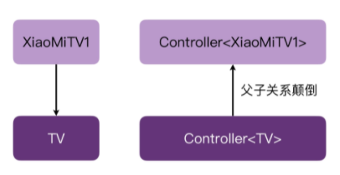
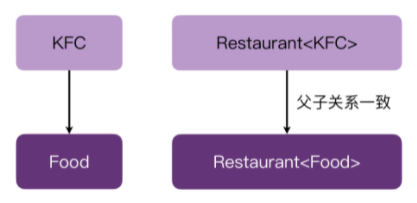

## Kotlin 泛型型变

<br />

### in、out？？？
Kotlin的源码中经常碰见\<in T\>、\<out T\>

<br />

### 泛型不变性？

eg.已知 Cat 是 Animal 的子类

```kotlin
fun setAnimal(animal: Animal) {}

fun setAnimalList(animals: MutableList<Animal>) {}

fun main1() {
    setAnimal(Cat())

    //编译器在这里就会提示错误
    setAnimalList(mutableListOf<Cat>())
}
```

在正常情况下编译器会认，MutableLis\<Cat\> 与 MutableList\<Animal\> 两者之间不存在任何继承关系，
<br />它们也无法互相替代没有任何关系，也就是说泛型是不变的。

<br />

### 泛型型变？

为了解决泛型的不变性，根据父子关系可分为逆变和协变。

<br />

### 逆变？

eg.已知 XiaoMiTV 是 TV 的子类，Controller 为遥控器可以控制打开各个型号的TV

```kotlin
open class TV {
    open fun turnOn() {}
}

class XiaoMiTV : TV() {
    override fun turnOn() {}
}

class Controller<T : TV> {
    fun turnOn(tv: T) {
        tv.turnOn()
    }
}
```

接下来，有一个open()方法传入一个XiaoMiTV的遥控器，通过遥控器去打开XiaoMiTV。

```kotlin
fun open(controller: Controller<XiaoMiTV>) {
    val xiaoMiTV = XiaoMiTV()
    controller.turnOn(xiaoMiTV)
}

fun main() {
    val controller = Controller<XiaoMiTV>()
    open(controller)
}
```

因为 TV 是所有电视机的父类，Controller 内部将会处理所有电视机型号的开机，Controller\<TV\> 其实就相当于一个万能遥控器。
<br />所以，理论上也可以通过传入一个万能遥控器 Controller\<TV\> 方式去打开XiaoMiTV电视。

```kotlin
fun main() {
    val controller = Controller<TV>()
    // 传入万能遥控器，报错类型不匹配
    open(controller)
}
```

这个时候可以通过 in 关键字进行逆变处理。

<br />

### 如何通过逆变解决编译器报错？

1、使用处逆变
<br />修改泛型参数的使用处代码，比如修改open()方法，在 XiaoMiTV 的前面增加一个 in 关键字。

```kotlin
fun open(controller: Controller<in XiaoMiTV>) {
    val xiaoMiTV = XiaoMiTV()
    controller.turnOn(xiaoMiTV)
}
```

2、声明处逆变
<br />修改 Controller 的代码，在泛型 T 的前面增加一个关键字 in。

```kotlin
class Controller<in T : TV> {
    fun turnOn(tv: T) {
        tv.turnOn()
    }
}
```

在这个场景下，遥控器与电视机之间的父子关系颠倒了。
<br />XiaoMiTV 是 TV的子类，但是万能遥控 Controller\<TV\> 反过来成了小米遥控 Controller\<XiaoMiTV\>的子类。

这种父子关系颠倒的现象，就是泛型的逆变。

<br />

### 协变？

eg.已知 汉堡包Hamburger 是 食物Food 的子类，有个饭店Restaurant可以生产各种类型的食物

```kotlin
open class Food {}

class Hamburger : Food() {}

class Restaurant<T : Food> {
    fun cookFood(): T { /*..*/ }
}
```

接下来，有一个orderFood()方法通过向餐厅点餐获取到餐厅对应食物的类型

```kotlin
fun orderFood(restaurant: Restaurant<Food>) {
    // 从这家饭店点餐获取对应食物
    val food = restaurant.cookFood()
}
```

此时如果想要获取到一个Hamburger，向orderFood()可以传入一个Restaurant\<Hamburger\>

```kotlin
fun main() {
    val hamburger = Restaurant<Hamburger>()
    // 编译器报错
    orderFood(hamburger)
}
```

这个时候可以通过 out 关键字进行协变处理。

<br />

### 如何通过协变解决编译器报错？

1、使用处协变
<br />修改泛型参数的使用处代码，比如修改orderFood()方法，在 Food 的前面增加一个 out 关键字。

```kotlin
fun orderFood(restaurant: Restaurant<out Food>) {
    val food = restaurant.cookFood()
}
```

2、声明处协变
<br />修改 Restaurant 的代码，在泛型 T 的前面增加一个关键字 out。

```kotlin
class Restaurant<out T : Food> {
    fun cookFood(): T { /*..*/ }
}
```

在这个场景下，食物与饭店它们之间的父子关系一致了。

这种现象就是泛型的协变。

<br />

### 逆变、协变的使用时机？

```kotlin
//逆变处理
class Controller<in T : TV> {
    fun turnOn(tv: T) {
        tv.turnOn()
    }
}

//协变处理
class Restaurant<out T : Food> {
    fun cookFood(): T { /*..*/ }
}
```

逆变的泛型 T，会以函数的入参的形式传入函数的里面，是一种写入行为不可以读取，这时候使用关键字 in。
<br />协变的泛型 T，会以返回值的形式被传出函数的外面，是一种读取行为不可以写入，这时候使用关键字 out 。
<br />总结为：泛型作为参数传入的时候，用 in；泛型作为返回值的时候，用 out。

<br />

### 如果泛型的 T，既是函数的参数类型，又是函数的返回值类型？

比如 Kotlin 源码当中的 List，这里的泛型 E，它既作为了返回值类型，又作为了参数类型。

```kotlin
public interface List<out E> : Collection<E> {
    public operator fun get(index: Int): E

    override fun contains(element: @UnsafeVariance E): Boolean

    public fun indexOf(element: @UnsafeVariance E): Int
}
```

这种情况下，如果只用 in 或 out 修饰 E，编译器都会报错。
<br />但是对于 contains、indexOf 这样的方法，它们虽然以 E 作为参数类型，但本质上并没有产生写入的行为。
<br />所以用 out 修饰 E 并不会带来实际的问题。这个时候就可以通过 @UnsafeVariance 注解，来让编译器忽略这个型变冲突的问题。

<br />

### 泛型总结

1、泛型具有不变性，但是可以通过型变打破不变性；
<br />2、从型变的位置来分类的话，分为使用处型变和声明处型变；
<br />3、从型变的父子关系来分类的话，分为逆变和协变。逆变表示父子关系颠倒了，而协变表示父子关系和原来一致；
<br />4、型变的使用：泛型作为参数，用 in；泛型作为返回值，用 out。在特殊场景下，同时作为参数和返回值的泛型参数，可以用 @UnsafeVariance 来解决型变冲突。