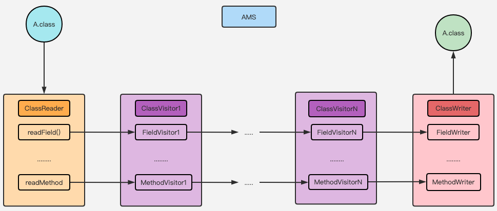

# AOP

AOP(Aspect Oriented Programming)：面向切面编程。

OOP(Object Oriented Programming)：面向对象编程。

区别？

OOP，纵向结构，注重业务逻辑单元的处理。

AOP，横向结构，涉及到众多模块的某一类问题，放到一个统一的地方来控制和管理，从而降低业务逻辑各部分之间的耦合。


应用：
日志记录、事件防抖、无痕埋点、方法耗时统计等等。


## AOP实现方式


## Transform API

Transform API：是 Gradle 提供一组封装好的 API，允许通过自定义插件，在Gradle编辑打包成.dex文件前获取字节码文件， 

然后遍历字节码文件的所有方法之后进行修改，最终替换原文件即可达到插入代码的目的。


API主要方法

```kotlin
    override fun getInputTypes(): Set<QualifiedContent.ContentType> {
        return TransformManager.CONTENT_CLASS
    }
```

getInputTypes()：指定 Transform 要处理的数据类型，一般处理 CLASSES 类型，包含了 class 文件和 jar 文件。

```kotlin
    override fun getScopes(): MutableSet<in QualifiedContent.Scope>? {
        return TransformManager.SCOPE_FULL_PROJECT
    }
```

getScopes()：指定 Transform 的作用域，例如：只处理当前项目、只处理子项目等。

```kotlin
    override fun isIncremental(): Boolean {
        return true
    }
```

isIncremental()：是否开启增量编译。

```kotlin
    override fun transform(transformInvocation: TransformInvocation) {
        val inputs: Collection<TransformInput> = transformInvocation.inputs
        val outputProvider: TransformOutputProvider = transformInvocation.outputProvider
        for (input in inputs) {
            for (jarInput in input.jarInputs) {
                //处理jar
            }
            for (directoryInput in input.directoryInputs) {
                //处理directory
            }
        }
    }
```

transform()：处理字节码文件流的切入点，通过入参可以拿到 TransformInput 和 TransformOutputProvider。

TransformInput：是指输入文件的抽象，它包含 DirectoryInput 集合（所有目录结构及其目录下的源码文件）与 
JarInput 集合（所有本地 jar 包和远程 jar 包）。

TransformOutputProvider：是指 Transform 的输出，通过它可以获取输出路径。

它的使用可以概括为：先从 TransformInput 接收我们需要的流，再从 TransformOutputProvider 输出我们处理过的流。

transform()主要完成接收流、处理流、输出流的过程，处理逻辑大同小异的。


## Transform 原理


每个 Transform 都是一个Gradle Task，编译器中的 TaskManager 将每个 Transform 串连起来。

第一个 Transform 会接收来自 javac 编译的结果，和本地的第三方依赖（jar、aar），还有resource资源。

这些编译的中间产物，在 Transform 组成的链条上传递，每个 Transform 节点可以对 class 进行处理再传递给下一个 Transform。

自定义的 Transform，会插入到整个 Transform 链条的最前面。

## ASM

ASM 是一个 Java 字节码操作和分析框架。它可以用来修改现有的类，或者直接以二进制形式动态生成类。

由于是在编译期间对字节码进行处理，运行时无明显性能代价。

不过使用上更接近字节码层面，因此学习成本更大。

ASM 框架核心类：



1、ClassReader：主要用来解析编译过的字节码文件。

2、ClassWriter：类用来重新构建修改的字节码文件，比如修改类属性以及方法。

3、ClassVisitor：主要负责访问类的成员信息，包括注解、构造方法、属性、方法、静态代码块。

在这里可以通过自定义 ClassVisitor,重写对应的 visit 方法就能达到修改字节码的目的。


4、MethodVisitor：主要负责访问方法的信息，用来进行具体的字节码操作和修改字节码。

### 简单实现

自定义一个 Gradle 插件，在插件中注册一个自定义的 Transform，然后在重写的 transform()中把 TransformInput 中包含的每一个字节码文件遍历并交给 ASM 框架进行修改，
再把每一个 ASM 框架处理后的字节码文件输出到 TransformOutputProvider。


1、自定义一个插件，注册一个自定义的 Transform


2、重写 transform()


3、过滤要处理的.class文件，交给 ASM 处理


4、ASM 访问类对应要处理的方法


5、字节码插入


通过ASM Bytecode Viewer 插件，可以把 Java 或者 Kotlin 代码转化成对应的字节码。  


