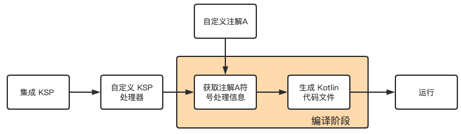
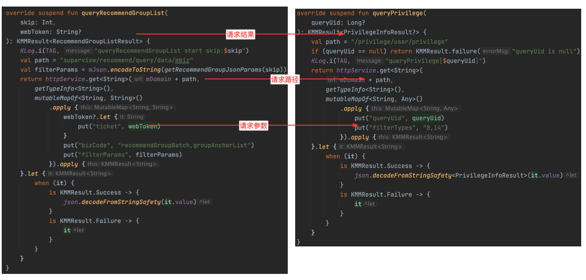
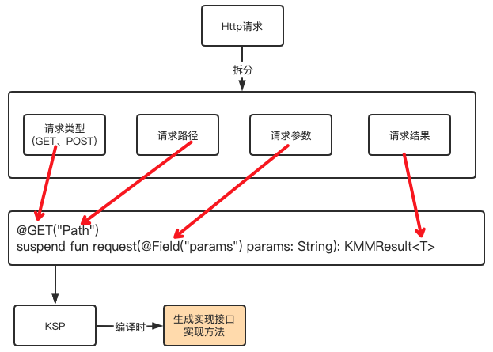

# Using KSP on KMM

## 一、KSP

### 什么是 KSP?

Kotlin Symbol Processing (KSP) 是一个在编译时通过注解生成代码的 Kotlin 插件。 
通过 KSP 可以帮助我们生成大量重复的代码，从而减少开发的工作量和提高代码的可读性和可维护性。

关键词：`编译时期`、`注解`、`生成代码`。

### KSP 与 APT(KAPT) 的对比

### 相同点

* 都是在编译时处理注解的工具。

* 都可以通过注解来生成代码或执行其他操作。

* 都需要使用 Gradle 或 Maven 等构建工具来集成到项目中。

### 差异点

#### 1、实现原理

APT 实现原理是基于 Java Compiler API 上的注解处理器 API， 
即在编译时使用 javac 将源代码编译成 Java 字节码文件，并在编译过程中调用注解处理器处理指定的注解。

KSP 实现原理是基于 Kotlin Compiler API 上的符号处理器 API， 
在编译时 KSP 就可以直接访问 Kotlin 代码中的类型、函数、属性等信息，而不需要进行额外的类型转换或者解析， 
也不需要生成额外的字节码文件。

主要差异：KSP 与 Kotlin `共享类型系统`。

#### 2、性能对比

* APT 和 Java 不共享类型系统，在编辑时期需要消耗更多的时间来加载和解析源代码文件。

* APT 需要先将源代码编译成字节码文件，这会消耗额外的时间和磁盘空间。

* KSP 支持增量编译，只有修改过的代码才会重新处理，大大提高了处理效率。

所以，KSP `性能和编译效率`高于 APT。 
官方在一个使用 Room 的项目进行编译对比，KSP 比 KAPT 编译快2倍以上。

#### 3、集成对比

KSP 插件已经包含在 Gradle 插件中，在集成到项目的时候无需再手动添加插件依赖项。

#### 4、跨平台

KSP 作为 Kotlin 编译器插件运行，无需依赖 Java 注释处理基础架构， 
意味着 KSP 可以在非 Android 以及非 JVM 环境 (如 Kotlin/Native 和 Kotlin/JS) 中使用。

### KSP 开发流程?

1、集成 KSP 插件。

2、自定义 KSP 处理器。

3、通过 KSP 处理器获取获取要处理的注解信息并生成Kotlin代码。

KotlinPoet？ 
一个开源的 Kotlin 代码生成器库，提供一些API可以以编程方式创建类、函数、属性等元素。

## 二、KSP 自动生成 Http 请求代码的分析

1、KMM 项目中现有 Http 请求代码分析，看起来请求参数都不一样，但是处理流程和要素都相同。

2、可以抽象出几个元素：请求方式（GET、POST）、请求路径、请求参数等。

3、是不是使用注解和一个接口方法就可以描述一个 Http 请求，类似于 Retrofit。

4、用一个接口把这些接口方法包出来，用 KSP 在编译时生成这个这个接口的实现类， 
并在内部实现 Http 请求，以后只需要用注解写一个请求接口那可以实现一个 Http 请求了？

## 三、Http 请求代码自动生成具体实现

详情可以参考一下工程：
[https://git.yy.com/apps/liveanchor/baizhankmm-homepage/-/tree/ksp](https://git.yy.com/apps/liveanchor/baizhankmm-homepage/-/tree/ksp)

1、请求相关注解定义 [HttpAnnotation](https://git.yy.com/apps/liveanchor/baizhankmm-homepage/-/blob/ksp/anotation/src/commonMain/kotlin/kmm/baizhan/homepage/anotation/HttpAnnotation.kt)。

2、KSP 插件集成到项目。

3、自定义 [KSP 处理器](https://git.yy.com/apps/liveanchor/baizhankmm-homepage/-/blob/ksp/kspcompiler/src/main/kotlin/kmm/baizhan/homepage/kspcompiler/KspProcessorProvider.kt)。

4、通过 KSP 处理器获取相关注解集合和信息。

5、通过 [KotlinPoet](https://git.yy.com/apps/liveanchor/baizhankmm-homepage/-/blob/ksp/kspcompiler/src/main/kotlin/kmm/baizhan/homepage/kspcompiler/HttpImplGenerator.kt) 实现生成 Kotlin 代码逻辑。

6、使用注解自定义一个[请求接口](https://git.yy.com/apps/liveanchor/baizhankmm-homepage/-/blob/ksp/homepage/src/commonMain/kotlin/kmm/baizhan/homepage/http/IHttpRecommendApi.kt)。

7、build 项目，在 `build/generated/ksp` 目录下生成对应 Kotlin 文件代码。

